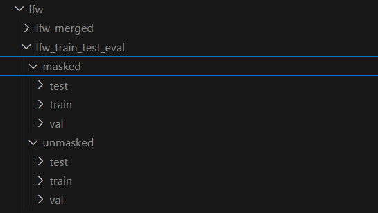

# Face Recognition Project

We had to use **Python version 3.6.15** only to compile the `dlib` library so that we could apply artificial masks to our dataset. Hence, our dependency with that particular Python version ends right after our masked images generation. Afterward, we can create a new Python virtual environment with version **3.8** or higher and run the entire train, test, and evaluation process using **CUDA support** for faster performance.

---

## Dataset Setup

1. **Download and Extract the Dataset**
   - Download the dataset from Kaggle: [LFW Dataset](https://www.kaggle.com/datasets/jessicali9530/lfw-dataset?resource=download#).
   - Extract the dataset into a folder named `lfw` (case-sensitive).

   The folder structure should look like this:

   

---

## Python Environment Setup

1. **Set Up and Configure `pyenv`**
   - Use `pyenv` to manage multiple Python virtual environments.
   - If you're on Windows, you can use [pyenv-win](https://github.com/pyenv-win/pyenv-win).

2. **Python Versions**
   - Create a new `pyenv` environment for **Python 3.6.15**
   - Create a new `pyenv` environment for **Python 3.10.4**.

3. **Activate Python 3.6.15**
   - Run the following command:
     ```bash
     source venv/bin/activate
     ```
   - Verify the Python version:
     ```bash
     python --version
     ```
     It should display `Python 3.6.15`.

   Install dependencies as mentioned in python3.6.15_required_libraries.txt

   The dlib library would give us some trouble, hence we need to install it from its whl file located inside
   wheelhouse/dlib-19.19.0-cp36-cp36m-linux_x86_64.whl

   For that run the commands ` cd wheelhouse
   python -m pip install dlib-19.19.0-cp36-cp36m-linux_x86_64.whl`
---

## Masking the Dataset

1. **Update the [config.py](http://_vscodecontentref_/1) File**
   - Update the `basepath` in [config.py](http://_vscodecontentref_/2) with the absolute path to the [lfw](http://_vscodecontentref_/3) folder (use an absolute path like `C://` on Windows).

2. **Add Masks to the Dataset**
   - Run the following command to add masks to the dataset:
     ```bash
     python mask_the_face.py --path "/root/face_recog/lfw/lfw-deepfunneled/lfw-deepfunneled" --code surgical-#0000FF,N95-#FF0000 --verbose
     ```
   - Replace the path with the absolute path to the `lfw-deepfunneled` folder in your workspace.

3. **Verify the Masked Dataset**
   - If everything went well, you should see a folder like this:

     

4. **Deactivate Python 3.6.15**
   - Run the following command:
     ```bash
     deactivate
     ```

---

## Training and Evaluation

1. **Activate Python 3.10.4**
   - Run the following command:
     ```bash
     pyenv shell 3.10.4
     ```
   - Verify the Python version:
     ```bash
     python --version
     ```
     It should display `Python 3.10.4`.

2. **Install Dependencies**
   - Install dependencies as mentioned in `python3.10.4_required_librairies.txt`

3. **Merge the Masked and Original Datasets**
   - Run the following script:
     ```bash
     python lfw_merger.py
     ```
   - This will create an `lfw_merged` directory under [lfw](http://_vscodecontentref_/4).

     

4. **Split the Dataset**
   - Run the following script:
     ```bash
      python lfw_data_split.py --datasetType masked // for splitting the masked dataset
       python lfw_data_split.py --datasetType unmasked // for splitting the original lfw dataset
     ```
   - This will create an `lfw_train_test_eval` directory under [lfw](http://_vscodecontentref_/5).

     

5. **Train the Model**
   - Run the following command:
     ```bash
      python arcface_train.py --epochs 5 --data_dir "/root/face_recog/lfw/lfw_train_test_eval/masked" --dataset_type masked_lfw
     ```
   - Customize the `--epochs` argument to values like `10`, `15`, `30`, or `50`.

   - **Note**:
     - The `--data_dir` argument should be the absolute path to the folder created after splitting the dataset.
     - The `--dataset_type` argument differentiates between `"masked_lfw"` and `"original_lfw"` datasets.

   - After training, a folder named [baseline_results](http://_vscodecontentref_/6) will be created:

     

   - This folder will contain:
     - The trained model.
     - Performance metrics.
     - Graphical data.

   - **Run for Both Masked and Unmasked Datasets**:
     - Modify the `--dataset_type` argument to `"original_lfw"` for the unmasked dataset.

6. **Evaluate the Model**
   - Run the following command:
     ```bash
     python arcface_eval.py --dataset_type "masked_lfw" --epochs 5
     ```

---

## Developer Logs

### 06/05/25
- **Issue**: The training process has a flaw causing `0.0` accuracy even after 30 iterations.
- **Action**: This needs to be addressed.

---